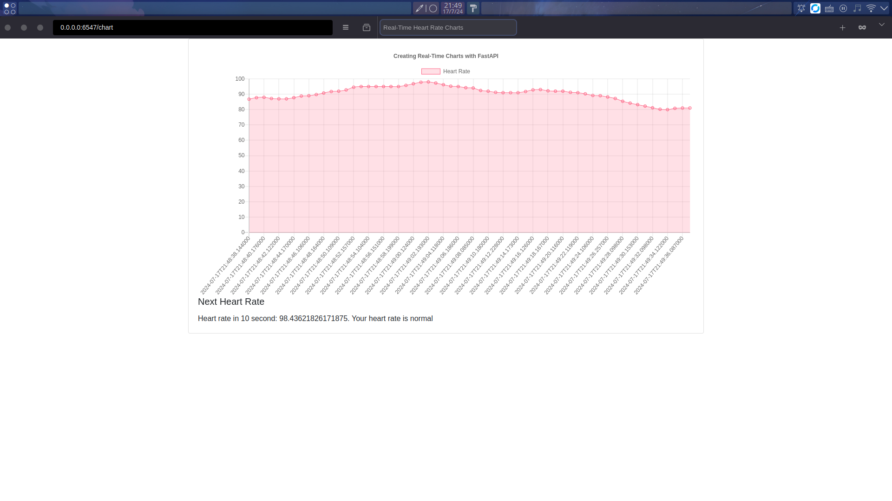

# Heart Watcher: A Heart rate monitoring system using Heart Rate data send from smart watch

## Introduction
This project is a heart rate monitoring system that uses heart rate data sent from a smart watch. The system is designed to monitor the heart rate of a person and send an alert to the user if the heart rate is above or below a certain threshold. The system is designed to be used by people who have heart conditions or are at risk of heart problems.

DEMO: 
<video src="https://github.com/user-attachments/assets/1d47a674-1145-4b0d-8308-55d22efb71df" controls preload></video>
## Features
- Monitor heart rate data sent from a smart watch
- Provide real-time heart rate data
- Predict heart rate in the future
- Send alerts to the user if the heart rate is above or below a certain threshold

## Technologies
- Python
- FastAPI
- Deep Learning
- MongoDB
- Redis
- Smart Watch API

## Usage
### Requirements
To run this project, install the required libraries using the following command:

```bash
pip install -r requirements.txt
```

Start mongodb and redis server:
```bash
docker compose up -d
```

### Run the project
To start the server, run the following command:

```bash
python api.py
```

This will start the FastAPI server on `http://<your-ip-address>:6547`.

Next, go to store and search for "Heart Rate to Bluetooth" and install the app on your smart watch.
Configure the app to connect bluetooth to your devices and the script will be started
Configure the app to send heart rate data to the server running on `http://<your-ip-address>:6547`.

Finally, open the browser and go to `http://<your-ip-address>:6547/chart` to see the real-time heart rate data and alerts.


